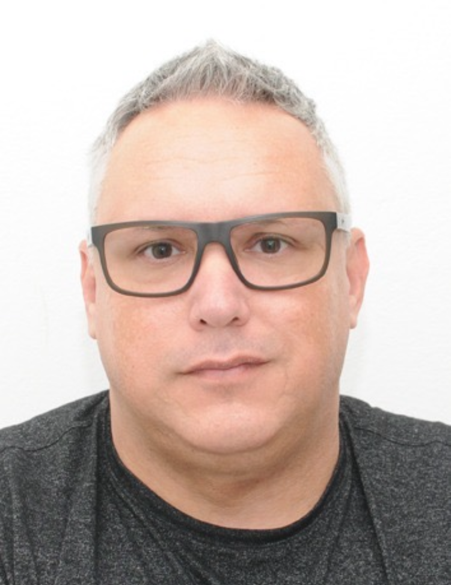

# Nome do Projeto
Sorriso Perfeiro
## Integrantes

[Davi Graff Da Rosa Silva](https://github.com/AlexSilvaRS)

---

## Índice
- [Descrição do Projeto](#descrição-do-projeto)
- [Badges](#badges)
- [...](#...)
- [...](#...)
- [...](#...)
- [...](#...)
---

## Descrição Detalhada do Projeto:
Este projeto está sendo realizado como
uma recaputalação do conteúdo de html,
css,JavaScript para entrar em PHP 

---

---

## Tecnologias Utilizadas (EXEMPLOS)
<!-- Badge HTML5 -->
- 
<!-- Badge CSS3 -->
- 
<!-- Badge JavaScript -->
- 
<!-- Badge GitHub Pages -->
- 
- **...** 
---

## IDEs/Editores utilizados
<!-- Badge Visual Studio Code -->

## Contatos
Links para contato profissional 

...

---
